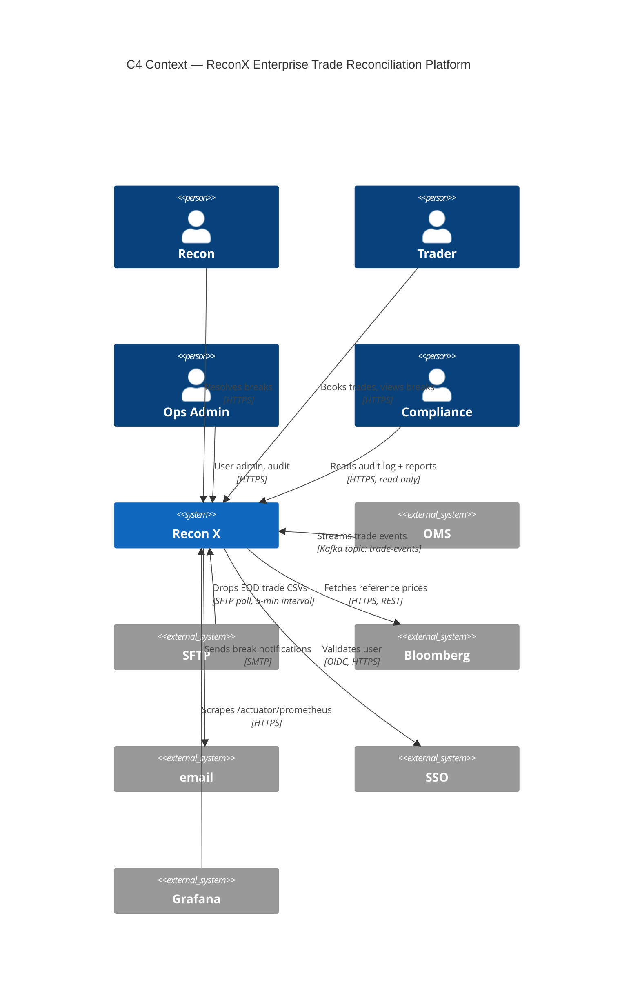

```mermaid
C4Context
    title C4 Context — ReconX Enterprise Trade Reconciliation Platform
    
    Person(reconAnalyst, "Recon")
    Person(trader, "Trader")
    Person(opsAdmin, "Ops Admin")
    Person(compliance, "Compliance")

    System(reconx, "Recon X")

    System_Ext(oms, "OMS")
    System_Ext(sftp, "SFTP")
    System_Ext(bloomberg, "Bloomberg")
    System_Ext(email, "email")
    System_Ext(sso, "SSO")
    System_Ext(grafana, "Grafana")

    Rel(trader, reconx, "Books trades, views breaks", "HTTPS")
    Rel(reconAnalyst, reconx, "Resolves breaks", "HTTPS")
    Rel(opsAdmin, reconx, "User admin, audit", "HTTPS")
    Rel(compliance, reconx, "Reads audit log + reports", "HTTPS, read-only")

    Rel(oms, reconx, "Streams trade events", "Kafka topic: trade-events")
    Rel(sftp, reconx, "Drops EOD trade CSVs", "SFTP poll, 5-min interval")
    Rel(reconx, bloomberg, "Fetches reference prices", "HTTPS, REST")
    Rel(reconx, email, "Sends break notifications", "SMTP")
    Rel(reconx, sso, "Validates user", "OIDC, HTTPS")
    Rel(grafana, reconx, "Scrapes /actuator/prometheus", "HTTPS")

```